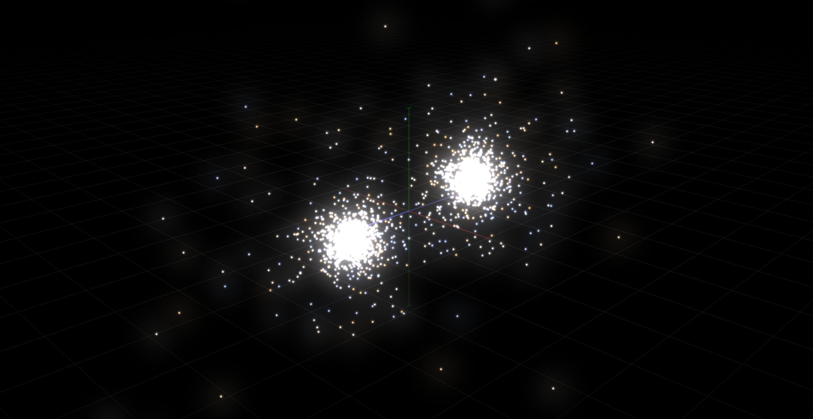

Parallel and Distributed Barnes-Hut N-Body Simulation
=====================================================

This collection of code follows the ideas of many people
(Warren, Salmon, Singh, Holt, Barnes, Hut, Aarseth) to implement
a Barnes-Hut (Octree) simulation for gravitational N-Body.

This code has two variations. A parallel version running on a shared-memory
multi-core/multi-processor using C++ threads, and another implemented using
OpenMPI for a distributed system.
An OpenGLv3.3 renderer is also developed to watch the simulation progress.

Accelerations/forces are computed via gravitational potential.
The integration scheme is a simple leapfrog scheme.
Direct and indirect interactions are computed with a softening factor
to avoid close encounters.
For indirect interactions (particle-cell interactions)
a multipole expansion is used to include the monopole and quadrupole terms.

## Code Organization

Most of the code is written in C with a little C++ to glue it all together
and for C++11 threads.

There are 3 main modules:
* The N-Body code (in src)
* OpenGL code for visualization (in src/ogl)
* Shared-Memory Parallel utilities (in src/parallel)

The main N-Body code is organized as:

* NBodyConfig: Compilation definitions, simulation meta-parameters.
* NBodyForces: Computations for interactions between particles (accelerations).
* NBodyHelpers: Simple helper functions like array manipulation, energy computations.
* NBodyInit: Data allocation and initialization functions, e.g. Plummer model.
* NBodyIntegrator: Simple integration code; leapfrog.
* NBodyKeys: Computation of, and sorting by, keys based on space-filling curves.
* NBodyMain: Hold the main function and parting of command line arguments.
* NBodyOctree: Octree definition, building, merging, mass/potential computations.
* NBodyHashedOctree: A hashed octree definition, building, branch nodes, mass/potential computations.
* NBodyParallel: Routines for parallel wrappers of tree building, interactions, integration.
* NBodySimulation: The main simulation loop.

## OpenGL Rendering

The OpenGL uses a mix of fixed function pipeline code for simple primitives
as well as programmable to use pretty shaders for the points. You should thus
run in 3.3 compatibility profile. Shader inspiration is credited in-file.

## Parallel Utils

The parallel utilities are all based on the standard C++11 Thread Support Library and
not much else. Two classes are of general interest:

* AsyncObjectStream: Implements effective producer-consumer communication using condition variables.
* ExecutorThreadPool: Implements long-running functor executing threads in a pool.

## An Explanation

Two technical reports are included in /doc.
One for the shared-memory version and one for the distributed-memory version.
The latter is more descriptive and the writing is mostly agnostic to a distributed or shared-memory
system. The reports describe the problem, the background, the math, and implementation details.